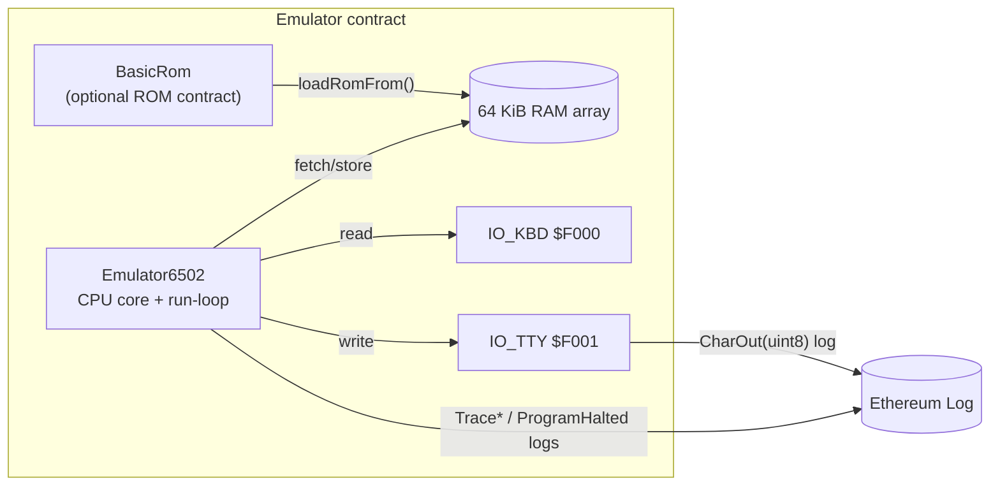

# 6502‑on‑EVM Emulator

This repository contains a pure‑Solidity implementation of the MOS 6502 CPU together with a **minimal C64‑style I/O environment** (keyboard and character terminal).  The goal is to execute unmodified 6502 machine‑code — such as EhBASIC 2.22 — inside the EVM for educational experiments and on‑chain retro‑computing.

## High‑level architecture



### Memory map (default)

| Range           | Purpose                                   |
|-----------------|-------------------------------------------|
| $0000 – $07FF   | Zero‑page & stack                         |
| $0800 – $9FFF   | Free RAM for user code / tests            |
| $A000 – $DFFF   | 16 KiB BASIC ROM (EhBASIC)                |
| $E000 – $EFFF   | Reserved                                  |
| $F000 – $F0FF   | Memory‑mapped I/O (KBD & TTY)             |
| $F100 – $F7FF   | Scratch for test stubs                    |
| $F800 – $FFFF   | Vectors & high ROM                        |

## Key contracts / files

| File | Description |
|------|-------------|
| `src/Emulator6502.sol` | Full CPU model, 64 KiB RAM, run‑loop, opcode dispatcher, soft‑vectors, and I/O emulation.  Emits `CharOut`, `TracePC`, `TraceJSR`, and `ProgramHalted` for observability. |
| `src/BasicRom.sol` | A contract whose **runtime byte‑code _is_ the EhBASIC ROM**.  It is loaded into RAM via `loadRomFrom(address, baseAddr)`. |
| `test/` | Extensive Foundry tests — unit tests for opcodes & addressing modes plus higher‑level integration tests (BASIC boot, Mini‑ROM demos). |

## Running the emulator

```bash
# build & test everything
forge test -vvv

# run only the minimal ROM demo (fast)
forge test --match-contract MiniRomHelloTest -vv
```

### Mini‑ROM "HELLO WORLD!" demo

`test/MiniRomHello.t.sol` injects 27 bytes of machine‑code at $9000:

```
$9000  A2 00        LDX #$00
$9002  BD 0D 90     LDA $900D,X
$9005  F0 13        BEQ $901A
$9007  8D 01 F0     STA $F001      ; write char → event
$900A  E8           INX
$900B  D0 F5        BNE $9002
$900D  "HELLO WORLD!" 00
$901A  00           BRK            ; vector via IRQ
```

The test captures `CharOut` events and asserts the exact string appears.  This proves the CPU core, memory system, and terminal I/O all function even without BASIC.

### BASIC integration (work‑in‑progress)

The long‑term objective is to run the full EhBASIC interpreter.  Current status:

* ROM loads and reaches the soft‑vector table.
* `CHRIN` stub & missing opcodes still under development.

Follow `test/HelloWorld.t.sol` for the debugging harness that traces PCs and JSRs.

## Development workflow

1. Write or modify tests in `test/`. Unit tests should prefer synthetic ROM snippets; integration tests may load `BasicRom`.
2. Implement opcodes in `Emulator6502.sol` – add helper methods next to their caller for locality.
3. `forge test -vvv` often; each commit/branch adds passing tests only.
4. Use `emit TracePC` & `pcTraceBuf` for deep ROM debugging.

---

The section below is the standard Foundry boiler‑plate for convenience.

## Foundry

**Foundry is a blazing fast, portable and modular toolkit for Ethereum application development written in Rust.**

Foundry consists of:

-   **Forge**: Ethereum testing framework (like Truffle, Hardhat and DappTools).
-   **Cast**: Swiss army knife for interacting with EVM smart contracts, sending transactions and getting chain data.
-   **Anvil**: Local Ethereum node, akin to Ganache, Hardhat Network.
-   **Chisel**: Fast, utilitarian, and verbose solidity REPL.

## Documentation

https://book.getfoundry.sh/

## Usage

### Build

```shell
$ forge build
```

### Test

```shell
$ forge test
```

### Format

```shell
$ forge fmt
```

### Gas Snapshots

```shell
$ forge snapshot
```

### Anvil

```shell
$ anvil
```

### Deploy

```shell
$ forge script script/Counter.s.sol:CounterScript --rpc-url <your_rpc_url> --private-key <your_private_key>
```

### Cast

```shell
$ cast <subcommand>
```

### Help

```shell
$ forge --help
$ anvil --help
$ cast --help
```

> **ELI5 – Why should I care?**  
> Imagine the tiny **MOS 6502** microprocessor as the brain inside 1980‑era home computers like the Commodore 64 or Apple II. With just **3 square millimetres of silicon and 3,510 transistors** it managed to run games, BASIC interpreters, and even early spreadsheets. Forty‑plus years later we can fit an entire global financial network on one of today's chips – but instead we decided to stick that little 6502 *inside* Ethereum, purely in software! 🤯  
>  
> This project shows how you can **emulate** an 8‑bit computer in Solidity so it runs deterministically in the EVM, producing events instead of pixels. It's half retro‑computing nostalgia, half smart‑contract engineering exercise. You can load unmodified 6502 machine‑code (like the EhBASIC interpreter) and watch it boot, read "keyboard" bytes, and print characters — all on chain.

## Building & loading ROMs

### 1  Author or obtain 6502 machine‑code

You can write 6502 assembly using any cross‑assembler (`[ca65](https://github.com/cc65/cc65)`, [`vasm`](http://www.compilers.de/vasm.html), etc.) or carve out raw bytes in a hex‑editor.

```asm
        ; hello.asm – assemble with ca65 & ld65
        * = $A000         ; origin inside RAM
        LDX #0            ; X = 0
LOOP    LDA MSG,X         ; load byte
        BEQ DONE         ; 0‑terminator ?
        STA $F001         ; output char
        INX
        BNE LOOP
DONE    BRK
MSG     .byte "HELLO",0
```

### 2  Package as a Solidity ROM contract *(optional)*

For larger programs you can embed the raw bytes in a contract so tests (or front‑ends) can deploy and `loadRomFrom()` it at runtime.  See `scripts/build_basic_rom.py` which generates `src/BasicRom.sol` from a 16 KiB binary.

### 3  Load the ROM into the emulator

```solidity
Emulator6502 emu = new Emulator6502();

// (A) Using an on‑chain ROM contract
BasicRom rom = new BasicRom();
emu.loadRomFrom(address(rom), 0xA000); // copy into RAM at $A000

// (B) Manual poke for small snippets
bytes memory code = hex"a9008d01f000"; // LDA #$00 ; STA $F001 ; BRK
for (uint16 i = 0; i < code.length; i++) {
    emu.poke8(0x8000 + i, uint8(code[i]));
}

// Set RESET vector so CPU starts executing at our code
emu.poke8(0xFFFC, 0x00);
emu.poke8(0xFFFD, 0x80); // -> $8000

emu.boot();
emu.run(10);
```

### 4  Observe output

Catch `CharOut(uint8)` logs in tests or front‑ends to reconstruct the terminal stream.  Use `TracePC`/`TraceJSR` for debugging and `ProgramHalted` for graceful termination.

## Where can you deploy it?

Running 64 KiB of RAM inside the EVM is storage‑heavy; some chains make that affordable, others not so much.  Here's a quick compatibility/economics matrix:

| Network / stack | 0.8.20 compiler | 24 kB code‑size cap | Gas price / storage cost | Verdict for this 6502 core |
|-----------------|-----------------|----------------------|---------------------------|----------------------------|
| **MegaETH** | ✔ | 24 kB (same as L1) | Ultra‑cheap, tuned for heavy on‑chain compute | **YES – ideal target** |
| **Monad** (test‑net upcoming) | ✔ (Solidity/EVM parity announced) | 24 kB | Very high throughput, low gas | Should work once live; good fit |
| **Arbitrum Orbit** (custom Nitro chains) | ✔ | 24 kB per contract | Chain operator can set near‑zero gas & high block gas | **YES – deploy on your own Orbit** |
| Arbitrum One / Nova | ✔ | 24 kB | Cheaper than L1 but `SSTORE` still pricey | Works technically, but each `step()` costs 0.3–0.6 M gas |
| Ethereum mainnet / Sepolia / Holesky | ✔ | 24 kB | Very high gas for 64 kB storage writes | Deploys, but running even a few hundred instructions exceeds block gas – impractical |
| OP‑Stack chains (Base, Mode, etc.) | ✔ | 24 kB | Similar to Arbitrum One | Technically OK, pricey in practice |
| zk‑rollups (Scroll, Linea, zkSync Era) | ✔ | 24 kB | Proof cost amplifies storage writes | Works, but economics worse than optimistic L2s |

built with love by Dennison Bertram & ChatGPT o3