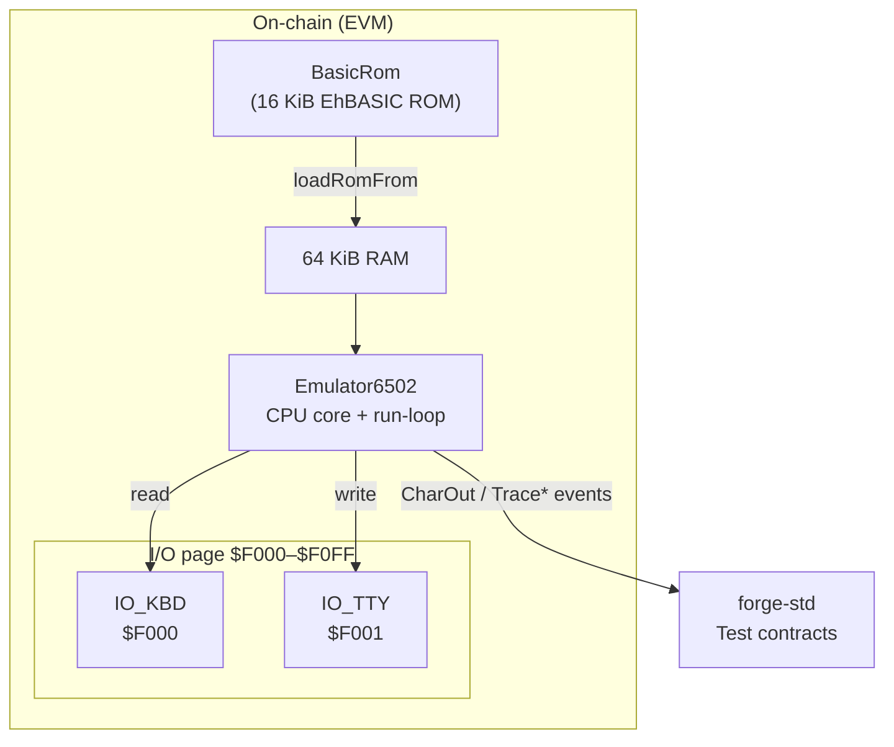

# 6502‑on‑EVM Emulator

This repository contains a pure‑Solidity implementation of the MOS 6502 CPU together with a **minimal C64‑style I/O environment** (keyboard and character terminal).  The goal is to execute unmodified 6502 machine‑code — such as EhBASIC 2.22 — inside the EVM for educational experiments and on‑chain retro‑computing.

## High‑level architecture



### Memory map (default)

| Range           | Purpose                                   |
|-----------------|-------------------------------------------|
| $0000 – $07FF   | Zero‑page & stack                         |
| $0800 – $9FFF   | Free RAM for user code / tests            |
| $A000 – $DFFF   | 16 KiB BASIC ROM (EhBASIC)                |
| $E000 – $EFFF   | Reserved                                  |
| $F000 – $F0FF   | Memory‑mapped I/O (KBD & TTY)             |
| $F100 – $F7FF   | Scratch for test stubs                    |
| $F800 – $FFFF   | Vectors & high ROM                        |

## Key contracts / files

| File | Description |
|------|-------------|
| `src/Emulator6502.sol` | Full CPU model, 64 KiB RAM, run‑loop, opcode dispatcher, soft‑vectors, and I/O emulation.  Emits `CharOut`, `TracePC`, `TraceJSR`, and `ProgramHalted` for observability. |
| `src/BasicRom.sol` | A contract whose **runtime byte‑code _is_ the EhBASIC ROM**.  It is loaded into RAM via `loadRomFrom(address, baseAddr)`. |
| `test/` | Extensive Foundry tests — unit tests for opcodes & addressing modes plus higher‑level integration tests (BASIC boot, Mini‑ROM demos). |

## Running the emulator

```bash
# build & test everything
forge test -vvv

# run only the minimal ROM demo (fast)
forge test --match-contract MiniRomHelloTest -vv
```

### Mini‑ROM "HELLO WORLD!" demo

`test/MiniRomHello.t.sol` injects 27 bytes of machine‑code at $9000:

```
$9000  A2 00        LDX #$00
$9002  BD 0D 90     LDA $900D,X
$9005  F0 13        BEQ $901A
$9007  8D 01 F0     STA $F001      ; write char → event
$900A  E8           INX
$900B  D0 F5        BNE $9002
$900D  "HELLO WORLD!" 00
$901A  00           BRK            ; vector via IRQ
```

The test captures `CharOut` events and asserts the exact string appears.  This proves the CPU core, memory system, and terminal I/O all function even without BASIC.

### BASIC integration (work‑in‑progress)

The long‑term objective is to run the full EhBASIC interpreter.  Current status:

* ROM loads and reaches the soft‑vector table.
* `CHRIN` stub & missing opcodes still under development.

Follow `test/HelloWorld.t.sol` for the debugging harness that traces PCs and JSRs.

## Development workflow

1. Write or modify tests in `test/`. Unit tests should prefer synthetic ROM snippets; integration tests may load `BasicRom`.
2. Implement opcodes in `Emulator6502.sol` – add helper methods next to their caller for locality.
3. `forge test -vvv` often; each commit/branch adds passing tests only.
4. Use `emit TracePC` & `pcTraceBuf` for deep ROM debugging.

---

The section below is the standard Foundry boiler‑plate for convenience.

## Foundry

**Foundry is a blazing fast, portable and modular toolkit for Ethereum application development written in Rust.**

Foundry consists of:

-   **Forge**: Ethereum testing framework (like Truffle, Hardhat and DappTools).
-   **Cast**: Swiss army knife for interacting with EVM smart contracts, sending transactions and getting chain data.
-   **Anvil**: Local Ethereum node, akin to Ganache, Hardhat Network.
-   **Chisel**: Fast, utilitarian, and verbose solidity REPL.

## Documentation

https://book.getfoundry.sh/

## Usage

### Build

```shell
$ forge build
```

### Test

```shell
$ forge test
```

### Format

```shell
$ forge fmt
```

### Gas Snapshots

```shell
$ forge snapshot
```

### Anvil

```shell
$ anvil
```

### Deploy

```shell
$ forge script script/Counter.s.sol:CounterScript --rpc-url <your_rpc_url> --private-key <your_private_key>
```

### Cast

```shell
$ cast <subcommand>
```

### Help

```shell
$ forge --help
$ anvil --help
$ cast --help
```
